  <h1>Hola, soy Frank Diego Gutierres Pacherres 👋</h1>

  

    <strong>Estudiante de Ingeniería de Sistemas e Informática</strong> · Desarrollador Web Frontend & Backend
  

  

---

## 🙋‍♂️ Sobre mí

Hola, mi nombre es **Frank Diego Gutierres Pacherres**, tengo **22 años** y actualmente soy estudiante del **9.º ciclo de Ingeniería de Sistemas e Informática** en la **Universidad Tecnológica del Perú (UTP)**.

Me interesa especialmente el área del **desarrollo de software** y **desarrollo web**, tanto **Frontend como Backend**. Durante mi formación académica he adquirido conocimientos en diferentes lenguajes, frameworks, bases de datos y herramientas que me permiten desarrollar aplicaciones y soluciones tecnológicas.

Me considero una persona interesada en seguir aprendiendo, mejorar constantemente mis habilidades de programación y participar en proyectos que me permitan aplicar mis conocimientos a situaciones reales. También busco continuar ampliando mi experiencia en el desarrollo de sistemas, creación de aplicaciones web y nuevas tecnologías relacionadas con la Ingeniería de Sistemas.

---

## 💻 Skills / Tecnologías

### Lenguajes & Frameworks

### Frontend & Estilos

### Bases de datos

---

## 📊 Estadísticas de GitHub

  
  

  

---

## 📫 Contacto

  
  
  

    

  

---

  <em>⭐ Gracias por visitar mi perfil. ¡Conectemos y construyamos algo genial juntos!</em>

